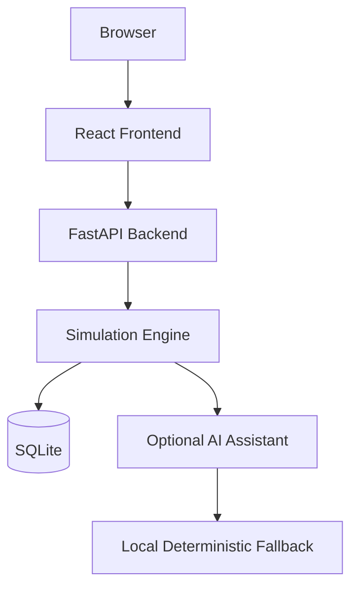

# CyberOps Architecture

## Components

- Browser: user-facing web client for interactive investigation.
- React Frontend: dashboard, incident workspace, analytics, demo controls.
- FastAPI Backend: API layer, validation, scenario orchestration, and persistence.
- Simulation Engine: deterministic training workflow for evidence, timeline, and scoring.
- SQLAlchemy: ORM layer for persistent analytics and leaderboard stores.
- SQLite: local database for seeded data and completed evaluation records.
- AI Assistant: optional explanation service that runs in simulation-safe mode.

## Design Goals

- Keep the app fully offline after installation.
- Provide deterministic results for demonstrations.
- Maintain a clear separation between the frontend, backend, and simulation engine.
- Allow future scenario authors to extend the engine without touching the UI logic.
